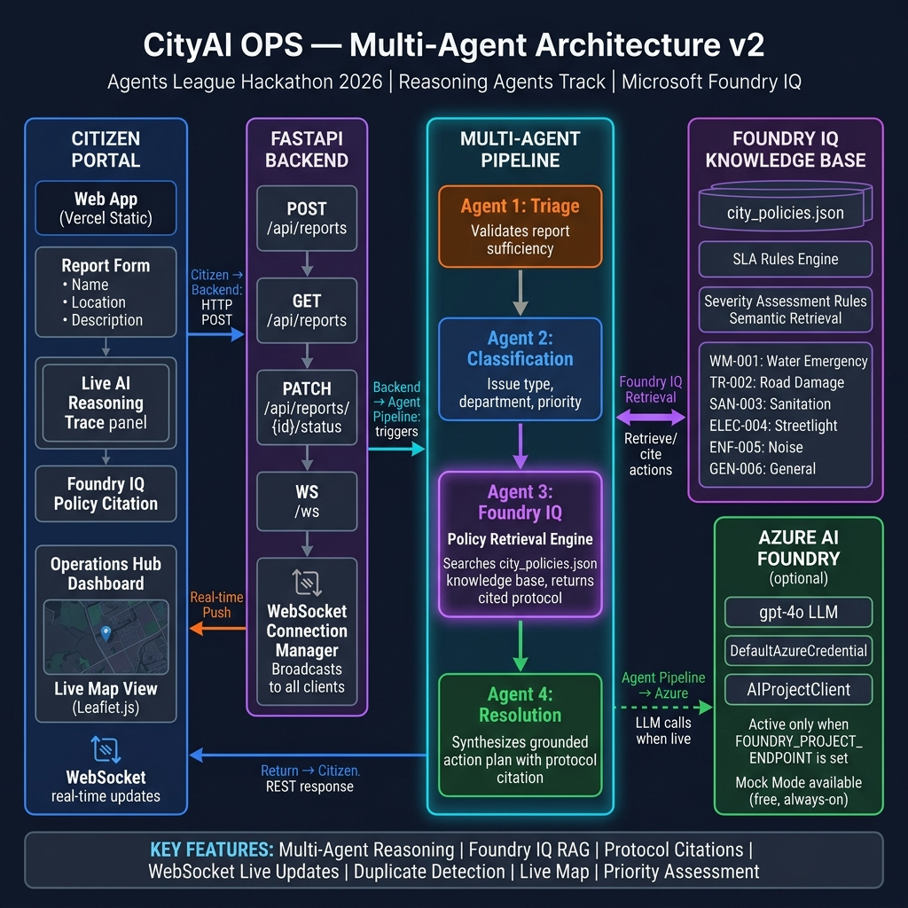

# CityAI OPS 🏙️
### AI-Powered Urban Issue Management — Agents League Hackathon 2026

> **Track:** 🧠 Reasoning Agents | **IQ Layer:** Foundry IQ | **Built with:** Microsoft Azure AI Foundry + FastAPI + Vanilla JS

An intelligent, multi-agent AI system that ingests citizen reports (potholes, water leaks, streetlights, etc.), routes them to the correct city department, cites official city protocols, and pushes live updates to city managers — all powered by a **Foundry IQ knowledge retrieval pipeline**.

---

## 🏗️ Architecture



---

## ✨ Key Features

| Feature | Description |
|---|---|
| 🤖 **Multi-Agent Pipeline** | 4 specialized agents: Triage → Classification → Foundry IQ Retrieval → Resolution |
| 📚 **Foundry IQ (RAG)** | Agent 3 retrieves city protocols from a local knowledge base and cites them in every answer |
| ⚡ **Real-Time WebSockets** | New reports are instantly broadcast to all connected dashboards — no refresh needed |
| 🗺️ **Live Issue Map** | Interactive Leaflet.js map with color-coded severity pins |
| 🔁 **Duplicate Detection** | Identifies and merges duplicate reports at the same location |
| 📊 **Operations Hub** | City manager dashboard with priority filtering, status updates, and AI insights |
| 🧠 **Follow-Up Questions** | Triage Agent asks citizens for more info when reports are too vague |

---

## 🤖 Multi-Agent Reasoning Pipeline

```
Citizen Report
      │
      ▼
┌─────────────────────────────┐
│  Agent 1: Triage            │  ← Is there enough info? Ask follow-up if not.
└────────────┬────────────────┘
             │
             ▼
┌─────────────────────────────┐
│  Agent 2: Classification    │  ← Determines issue type, department, initial priority
└────────────┬────────────────┘
             │
             ▼
┌─────────────────────────────┐
│  Agent 3: Foundry IQ        │  ← Retrieves the relevant City Protocol from knowledge base
│  Policy Retrieval Engine    │     e.g. "Protocol WM-001 — Emergency Water Infrastructure"
└────────────┬────────────────┘     SLA: Respond within 1h, resolve within 4h.
             │
             ▼
┌─────────────────────────────┐
│  Agent 4: Resolution        │  ← Synthesizes a grounded, protocol-cited action plan
└─────────────────────────────┘
             │
             ▼
   WebSocket Broadcast → All Connected Dashboards & Maps
```

---

## 💡 Foundry IQ Integration

This project satisfies the **Foundry IQ** requirement through a local knowledge retrieval engine:

- **Knowledge Base:** `backend/data/city_policies.json` — 6 city protocols with SLAs, severity rules, crew requirements, and step-by-step resolution procedures.
- **Retrieval:** Agent 3 performs keyword-scored retrieval to find the most relevant protocol for each report.
- **Grounded Answers:** Every resolution plan cites the exact protocol ID (e.g., *"Per Protocol TR-002: Deploy road maintenance crew within 2 hours..."*)
- **Hallucination Reduction:** The agent cannot invent steps — it is constrained to the retrieved policy document.

When `FOUNDRY_PROJECT_ENDPOINT` is set, all 4 agents make real calls to **Azure AI Foundry (gpt-4o)**. Without it, a smart mock mode handles all reasoning while Foundry IQ retrieval remains fully active.

---

## 🛠️ Tech Stack

| Layer | Technology |
|---|---|
| **Frontend** | Vanilla JS, HTML5, CSS3 (Glassmorphism UI), Leaflet.js |
| **Backend** | Python 3.11, FastAPI, WebSockets (uvicorn[standard]) |
| **AI / IQ** | Microsoft Azure AI Foundry (`gpt-4o`), Foundry IQ local RAG |
| **Deployment** | Vercel (frontend static + backend serverless) |
| **Real-Time** | WebSocket `/ws` endpoint with ConnectionManager |

---

## 💻 Local Setup

1. Clone the repository.
2. Run `start.bat` on Windows to launch both servers automatically!
   - Frontend: `http://localhost:8080`
   - Backend API: `http://127.0.0.1:8000`
   - WebSocket: `ws://127.0.0.1:8000/ws`

### (Optional) Connect to Real Azure AI Foundry
By default, the app runs in **Mock Mode** (free, no API key needed). To connect to a live model:

1. Log in: `az login`
2. Create `backend/.env`:
```env
FOUNDRY_PROJECT_ENDPOINT=https://your-project.services.ai.azure.com/api/projects/my-project
FOUNDRY_MODEL_DEPLOYMENT_NAME=gpt-4o
```

---

## 🌐 Deployment

Deployed on **Vercel** as a monorepo:
- Frontend → Vercel Static Hosting
- Backend FastAPI → Vercel Serverless Functions (`@vercel/python`)
- WebSockets fall back to 30-second polling on Vercel (full WS available when running locally)

---

## 📁 Project Structure

```
AI Hackathon/
├── frontend/
│   ├── index.html          # 4-tab UI: Citizen Portal, Operations Hub, Map, Insights
│   ├── app.js              # WebSocket client, multi-agent trace renderer
│   └── styles.css          # Premium glassmorphism dark theme
├── backend/
│   ├── main.py             # FastAPI server + WebSocket ConnectionManager
│   ├── agent.py            # 4-Agent pipeline + FoundryIQRetriever
│   ├── data/
│   │   └── city_policies.json  # Foundry IQ Knowledge Base (6 protocols)
│   └── requirements.txt
├── architecture_diagram.png
├── vercel.json
└── start.bat               # One-click local launcher (Windows)
```
